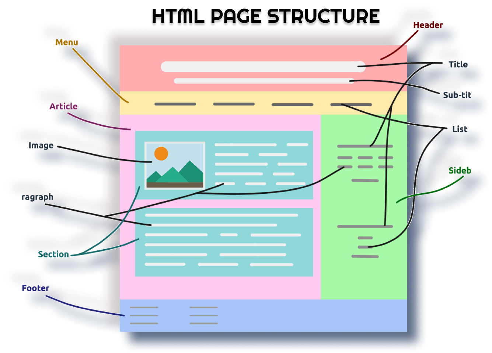

# Formação HTML5

## Descrição
Uma breve descrição do seu projeto.

## Sumário
- [Formação HTML5](#formação-html5)
  - [Descrição](#descrição)
  - [Sumário](#sumário)
  - [Formulário HTML](#formulário-html)
  - [Restrições de Entrada](#restrições-de-entrada)
- [Div vs. Span](#div-vs-span)
  - [Div:](#div)
  - [Span:](#span)
- [Estrutura básica de um página web](#estrutura-básica-de-um-página-web)
- [fieldset](#fieldset)
- [Cores no navegador](#cores-no-navegador)
  - [Hexadecimal](#hexadecimal)
- [Entendendo tags de mídia](#entendendo-tags-de-mídia)
    - [Tag ``](#tag-img)
    - [Tag `<audio>`](#tag-audio)
    - [Tag `<video>`](#tag-video)
    - [Tag `<track>`](#tag-track)
    - [Tag `<iframe>`](#tag-iframe)
- [Algumas Tags HTML5 Semânticas](#algumas-tags-html5-semânticas)


## Formulário HTML
[Voltar para o Sumário](#sumário)

A tag `<form>` é usada para criar um formulário HTML que permite aos usuários inserir e enviar dados para um servidor.

1. name: Identifica o formulário e é usado para acessar os dados do formulário no lado do servidor.

Exemplo: `<form name="loginForm">`

2. action: Especifica para onde os dados do formulário serão enviados quando submetidos.

Exemplo: `<form action="processar_dados.php">`

3. method: Especifica como os dados do formulário serão enviados. Os valores comuns são GET e POST.

Exemplo: `<form method="POST">`
   - GET: Os dados do formulário são anexados à URL como uma string de consulta. É adequado para formulários de pesquisa ou envio de pequenas quantidades de dados não sensíveis.
   - POST: Os dados do formulário são enviados no corpo da solicitação HTTP. É mais seguro para enviar grandes quantidades de dados ou dados sensíveis, como senhas.

4. target: Especifica onde abrir o resultado do envio do formulário, como "_blank" para abrir em uma nova janela.

Exemplo: `<form target="_blank">`

5. enctype: Especifica como os dados do formulário devem ser codificados antes de serem enviados, útil principalmente para envio de arquivos.

Exemplo: `<form enctype="multipart/form-data">`

6. novalidate: Desativa a validação de formulário HTML5 embutida.

Exemplo: `<form novalidate>`

7. accept-charset: Especifica a codificação de caracteres que o servidor deve usar para interpretar os dados do formulário.

Exemplo: `<form accept-charset="UTF-8">`

8. methodoverride: Substitui o método de envio do formulário quando o navegador não suporta o método especificado pelo atributo "method".

Exemplo: `<form methodoverride="PUT">`

## Restrições de Entrada
[Voltar para o Sumário](#sumário)

Aqui está uma lista de algumas restrições comuns de entrada:

| Atributo  | Descrição                                                                               |
| --------- | --------------------------------------------------------------------------------------- |
| checked   | Especifica que um campo de entrada deve ser pré-selecionado quando a página é carregada |
| disabled  | Especifica que um campo de entrada deve ser desativado                                  |
| max       | Especifica o valor máximo para um campo de entrada                                      |
| maxlength | Especifica o número máximo de caracteres para um campo de entrada                       |
| min       | Especifica o valor mínimo para um campo de entrada                                      |
| pattern   | Especifica uma expressão regular para verificar o valor de entrada                      |
| readonly  | Especifica que um campo de entrada é somente leitura (não pode ser alterado)            |
| required  | Especifica que um campo de entrada é obrigatório (deve ser preenchido)                  |
| size      | Especifica a largura (em caracteres) de um campo de entrada                             |
| step      | Especifica os intervalos numéricos legais para um campo de entrada                      |
| value     | Especifica o valor padrão para um campo de entrada                                      |

Exemplo de Uso:


<input type="checkbox" id="pre-selected" name="pre-selected" checked>
<label for="pre-selected">Pré-selecionado</label><br>

<input type="number" id="min-max" name="min-max" min="1" max="10">
<label for="min-max">Entre 1 e 10</label><br>

<input type="text" id="max-length" name="max-length" maxlength="20">
<label for="max-length">Até 20 caracteres</label><br>

<input type="text" id="pattern" name="pattern" pattern="[A-Za-z]{3}">
<label for="pattern">Apenas letras (3 caracteres)</label><br>

<input type="text" id="readonly" name="readonly" readonly value="Somente Leitura">
<label for="readonly">Somente Leitura</label><br>

<input type="text" id="required" name="required" required>
<label for="required">Campo Obrigatório</label><br>

```html

<input type="checkbox" id="pre-selected" name="pre-selected" checked>
<label for="pre-selected">Pré-selecionado</label><br>

<input type="number" id="min-max" name="min-max" min="1" max="10">
<label for="min-max">Entre 1 e 10</label><br>

<input type="text" id="max-length" name="max-length" maxlength="20">
<label for="max-length">Até 20 caracteres</label><br>

<input type="text" id="pattern" name="pattern" pattern="[A-Za-z]{3}">
<label for="pattern">Apenas letras (3 caracteres)</label><br>

<input type="text" id="readonly" name="readonly" readonly value="Somente Leitura">
<label for="readonly">Somente Leitura</label><br>

<input type="text" id="required" name="required" required>
<label for="required">Campo Obrigatório</label><br>
```

# Div vs. Span
[Voltar para o Sumário](#sumário)

## Div:

A `<div>` é um elemento de bloco em HTML usado para agrupar elementos em uma seção ou área específica de uma página da web. Ele cria um bloco que normalmente ocupa toda a largura disponível. É frequentemente usado para dividir o layout da página em seções distintas e aplicar estilos CSS a essas seções.

Exemplo de uso de `<div>`:

```html
<div id="header">
    <h1>Título do site</h1>
    <p>Descrição do site</p>
</div>
```
Neste exemplo, o `<div>` com o id "header" é usado para agrupar o título e a descrição do site em uma seção de cabeçalho.

## Span:
[Voltar para o Sumário](#sumário)

O `<span>` é um elemento de linha em HTML usado para aplicar estilos a partes específicas de um texto dentro de um elemento de bloco, como `<div>`, `<p>`, `<h1>`, etc. Ele não cria uma quebra de linha, ao contrário do `<div>`, e é útil para aplicar estilos a partes específicas de texto ou para inserir elementos inline dentro de um bloco.

Exemplo de uso de `<span>`:

```html
<p>Este é um parágrafo com <span style="color: blue;">texto azul</span> dentro dele.</p>
```
Neste exemplo, o <span> é usado para aplicar a cor azul apenas ao texto "texto azul" dentro do parágrafo.

# Estrutura básica de um página web
[Voltar para o Sumário](#sumário)




- ELEMENTOS (VERDE)- TAGS HTML.

- GRUPO DE ELEMENTOS (VERMELHA) - 1 TAG HTML QUE AGRUPA OS ELEMENTOS.

- CONTAINER (AZUL) - 1 TAG HTML QUE AGRUPA ELEMENTOS E GRUPOS.


```mermaid
CONTAINER --> 
          "GRUPO DE ELEMENTOS" -->
                              ELEMENTOS
```


# fieldset
[Voltar para o Sumário](#sumário)

Definição e uso:

 A `<fieldset>` tag é usada para agrupar elementos relacionados em um formulário.

A  `<fieldset>` tag desenha uma caixa ao redor dos elementos relacionados.

Dicas e notas
Dica: A tag `<legend>` é usada para definir uma legenda para o  `<fieldset>` elemento.

EXEMPLO:

<form action="/action_page.php">
  <fieldset>
    <legend>Personalia:</legend>
    <label for="fname">First name:</label>
    <input type="text" id="fname" name="fname"><br><br>
    <label for="lname">Last name:</label>
    <input type="text" id="lname" name="lname"><br><br>
    <label for="email">Email:</label>
    <input type="email" id="email" name="email"><br><br>
    <label for="birthday">Birthday:</label>
    <input type="date" id="birthday" name="birthday"><br><br>
    <input type="submit" value="Submit">
  </fieldset>
</form>

# Cores no navegador
[Voltar para o Sumário](#sumário)

 -  RGB: Combinação de Vermelho, Verde e Azul (Red, Green, Blue)
 -  HEX: Combinação de Vermelho, Verde e Azul, mas descrito em Hexadecimal
-  HSL: Matiz (Hue), Saturação (Saturation) e Iluminação (Lighten). A matiz tem os valores onde 0 é
vermelho, 120 verde, 240 azul.
-  RGBA: Mesmo que RGB, porémadicionado canal Alpha (Transparência)
-  HSLA: Mesmo que HSL, porémadicionado canal Alpha (Transparência
  
  

## Hexadecimal
0,1,2,3,4,5,6,7,8,9,10,11,12,13,14,15 <br>
0,1,2,3,4,5,6,7,8,9, A, B, C, D, E, F

#RRGGBB -> #FF0000 -> 255 0 0

```html
<!DOCTYPE html>
<html lang="en">
<head>
    <meta charset="UTF-8">
    <meta http-equiv="X-UA-Compatible" content="IE=edge">
    <meta name="viewport" content="width=device-width, initial-scale=1.0">
 <title>Trilha HTML - Dio</title>
<style>
    .card1{
        border: solid 1px black;
        width: 150px;
        height: 150px;
        position: absolute;
        left: 40%;
        top: 40%;
        z-index: 1;
        background-color: aquamarine;
    }
    .card2{
        border: solid 1px black;
        width: 110px;
        height: 110px;
        position: absolute;
        left: 35%;
        top: 35%;
        z-index: 2;
        background-color: rgba(255, 0, 0, 0.5);
        
        /* Atalho comentário - CTRL + ;
        background-color: hsla(300, 100%, 50%, 0.5);
        background-color: hsl(300, 100%, 50%);
        background-color: #FF00FF;
        background-color: rgb(255, 0, 255);
         */

    }
</style>
</head>
<body>
    <div class="card1"></div>
    <div class="card2"></div>
</body>
</html>
```
# Entendendo tags de mídia
[Voltar para o Sumário](#sumário)


### Tag ``
Essa tag é usada para inserir imagens em uma página da web. O atributo `src` é obrigatório e especifica o caminho da imagem. Outros atributos comuns incluem `alt` para fornecer um texto alternativo para a imagem e `width` e `height` para definir as dimensões da imagem.
Obs: title e alt é recomendavel para fornecer acessibilidade.

Exemplo:
```html

```

### Tag `<audio>`
Essa tag é usada para incorporar conteúdo de áudio em uma página da web. O atributo `src` é obrigatório e especifica o caminho do arquivo de áudio. Outros atributos podem incluir `controls` para exibir controles de reprodução.

Exemplo:
```html
<audio controls>
  <source src="caminho_do_audio.mp3" type="audio/mpeg">
  Seu navegador não suporta o elemento de áudio.
</audio>
```

### Tag `<video>`
Essa tag é usada para incorporar conteúdo de vídeo em uma página da web. O atributo `src` é obrigatório e especifica o caminho do arquivo de vídeo. Assim como na tag `<audio>`, pode-se utilizar o atributo `controls` para exibir controles de reprodução e `autoplay` para iniciar o áudio assim que abrir a página(opcional). 

Exemplo:
```html
<video controls autoplay width="400" height="300">
  <source src="caminho_do_video.mp4" type="video/mp4">
  Seu navegador não suporta o elemento de vídeo.
</video>
```

### Tag `<track>`
Essa tag é usada em conjunto com a tag `<video>` ou `<audio>` para fornecer legendas, transcrições ou descrições de áudio/vídeo. O atributo `src` especifica o caminho do arquivo de legenda e o atributo `kind` define o tipo de legenda (legendas, legendas descritivas, etc.).

Exemplo:
```html
<video controls>
  <source src="caminho_do_video.mp4" type="video/mp4">
  <track src="legendas.vtt" kind="subtitles" srclang="pt" label="Português">
  Seu navegador não suporta o elemento de vídeo.
</video>
```

### Tag `<iframe>`
Essa tag é usada para incorporar uma página da web dentro de outra página da web. O atributo `src` especifica o URL da página a ser incorporada.

Exemplo:
```html
<iframe 
src="pagina_incorporada.html"
width="600" 
height="400" 
frameborder="0" 
allowfullscreen
>
</iframe>
```
# Algumas Tags HTML5 Semânticas 
[Voltar para o Sumário](#sumário)

1. `<abbr>`: Define uma abreviação ou uma sigla, fornecendo uma expansão opcional para ela.
2. `<address>`: Define informações de contato, geralmente informações de contato para o autor de um documento ou artigo.
3. `<article>`: Marca conteúdo independente e auto-contido, como um post de blog, uma notícia, um comentário, etc.
4. `<aside>`: Define conteúdo que está relacionado com o conteúdo em torno dele, mas não é essencial para a sua compreensão.
5. `<blockquote>`: Utilizada para definir uma seção de citação longa ou um bloco de texto citado.
6. `<cite>`: Utilizada para marcar o título de uma obra, como um livro, um artigo ou uma música.
7. `<code>`: Define uma parte de texto que deve ser exibida em uma fonte de código ou em um formato monoespaçado.
8. `<datalist>`: Utilizada para fornecer uma lista de opções para um elemento de entrada `<input>`.
9. `<details>`: Utilizada para criar um elemento de detalhes que pode ser expandido ou colapsado para exibir ou ocultar o conteúdo associado.
10. `<dialog>`: Define uma caixa de diálogo ou uma janela de alerta na interface do usuário.
11. `<figcaption>`: Usada em conjunto com a tag `<figure>`, fornece uma legenda ou uma descrição para o conteúdo encapsulado pela tag `<figure>`.
12. `<figure>`: Utilizada para encapsular algum conteúdo que está relacionado, como uma imagem, uma ilustração, um diagrama, um vídeo, entre outros. Normalmente é acompanhada da tag `<figcaption>` para fornecer uma legenda para o conteúdo.
13. `<footer>`: Define o rodapé de um documento ou uma seção.
14. `<header>`: Define o cabeçalho de um documento ou uma seção.
15. `<kbd>`: Define o texto de entrada do teclado.
16. `<main>`: Define o conteúdo principal de um documento HTML. Normalmente, há apenas um elemento `<main>` em um documento.
17. `<mark>`: Utilizada para destacar partes de um texto.
18. `<meter>`: Utilizada para medir uma quantidade dentro de um intervalo conhecido, como a quantidade de armazenamento usado em um disco ou a força de um sinal.
19. `<nav>`: Define uma seção de navegação.
20. `<progress>`: Define uma barra de progresso para indicar o progresso de uma tarefa ou processo.
21. `<q>`: Define uma citação curta em linha.
22. `<samp>`: Utilizada para representar uma saída de programa de amostra ou um resultado.
23. `<section>`: Utilizada para definir seções em um documento, como capítulos, cabeçalhos, rodapés ou qualquer outra parte do documento.
24. `<summary>`: Usada em conjunto com a tag `<details>`, fornece um resumo ou título para o conteúdo expandido ou oculto.
25. `<time>`: Utilizada para representar datas e horas em um formato legível para humanos.
26. `<var>`: Define uma variável em um contexto matemático ou em um contexto de programação.
27. ``<picture>`: Utilizada para fornecer várias fontes de uma imagem para diferentes condições de exibição.
